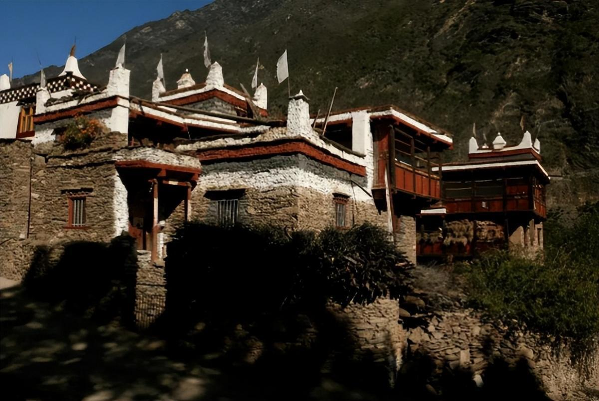
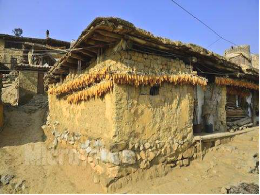
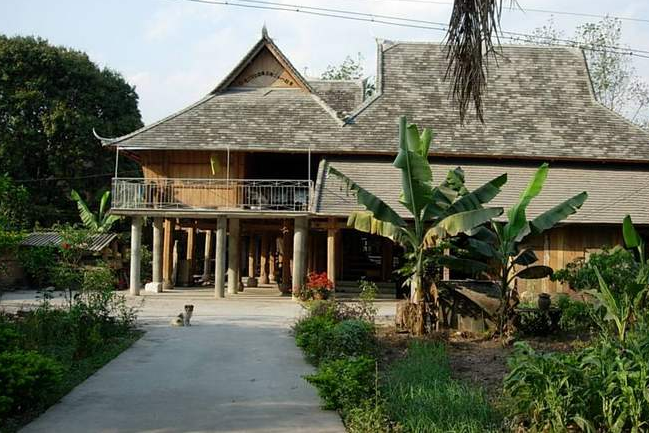
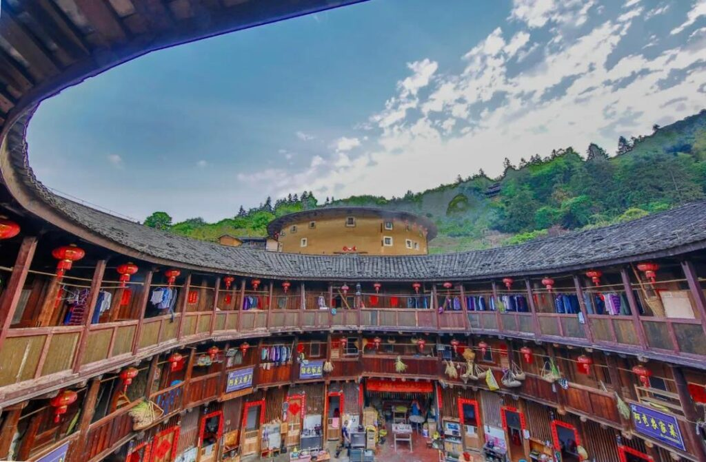
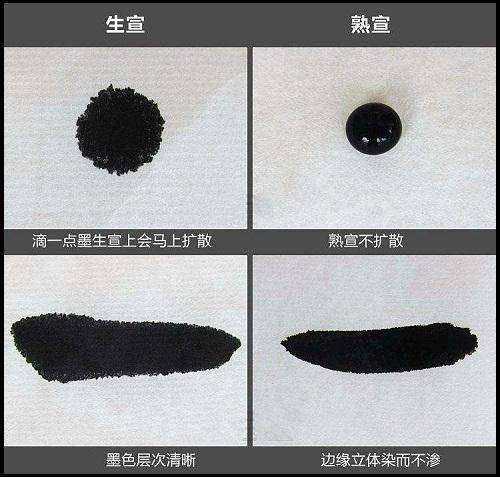
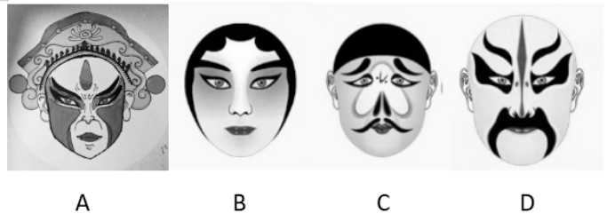
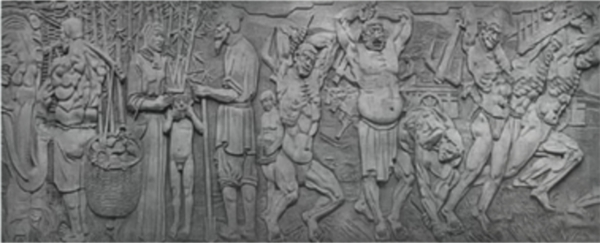

> 1.（2025）下列关于我国重要历史文物的叙述**错误**的是：
>
> A 青铜器“利簋”又名“武王征商簋”，其铭文记载了武王伐纣这一历史事件
>
> B 三星堆遗址出土了青铜大立人像、青铜神树、金面罩等珍贵文物
>
> C 新疆出土的汉代织锦护臂，织有“五星出东方利中国”八字
>
> D 位于陕西西安的半坡遗址出土了嵌绿松石象牙杯
>

商代嵌绿松石象牙杯出土于**河南安阳殷墟妇好墓**（商代晚期），而陕西西安半坡遗址属于新石器时代的**仰韶文化**。

| 文化类型   | 所在地               | 代表                                                         |
| ---------- | -------------------- | ------------------------------------------------------------ |
| 仰韶文化   | 陕西西安==半坡遗址== | 制作==彩陶==；我国是世界上最早种植==粟==的国家               |
| 龙山文化   |                      | ==黑陶==文化                                                 |
| 三星堆     |                      | 青铜==神树==、纵目==面具==、黄金==权杖==的核心文物           |
| 河姆渡文化 | 浙江余姚             | 我国是世界上最早种植==水稻==的国家                           |
| 良渚文化   |                      | “中华第一城”；世界最早的水坝；==玉琮==是最具代表性的玉器器类 |
| 大汶口文化 |                      | 我国是世界上最早发展==养蚕和丝织==的国家                     |

参考答案：D

&nbsp;

> 2.（2025）下列有关中国古代建筑的说法**错误**的是：
>
> A 楼是“重屋”，指的是两层及以上的建筑物
>
> B 阁是一种半开放的建筑，常建于水边供人们赏景
>
> C 舫是仿照船型而造的一种建筑，又被称为“不系舟”
>
> D 亭一般为开敞性结构，没有围墙，顶部可分为六角、八角等形状

常听说==藏书阁==，故不是用来建于水边供人们赏景的建筑。

| 建筑类型  | 核心功能/特征                                | 常见地点/用途                                    | 易混淆点                                                     |
| :-------- | :------------------------------------------- | :----------------------------------------------- | :----------------------------------------------------------- |
| **楼**    | 两层或以上的**多层建筑**。                   | 居住、登高远眺。                                 | 与“阁”有时连用（楼阁），但“楼”的核心在于“重屋”。             |
| **阁**    | 底部架空、四周设门窗的**储藏或纪念性建筑**。 | 藏书（天一阁）、供佛（佛香阁）、军事（滕王阁）。 | **易与“榭”混淆**。“榭”是临水观景的**开敞**建筑；“阁”则不必然临水，且更封闭。 |
| **亭**    | 有顶无墙、完全**开敞**的观景休憩点。         | 园林、路边。                                     | 顶部形状多样是其显著特点。                                   |
| **舫**    | 仿船形的**园林景观建筑**，不航行。           | 建于园林水池边，称“不系舟”。                     | 造型独特，不易与其他混淆。                                   |
| **轩/榭** | 临水而建的**开敞式观景建筑**。               | 园林水边。                                       | **这正是B选项描述的对象**，而非“阁”。                        |

参考答案：B

&nbsp;

> 3.（2025）下列诗文涉及的人物或事件对应的时期**错误**的是：
>
> A 合从离衡，佩印者六——战国
>
> B 饮马瀚海，封狼居胥——东汉
>
> C 被遇神宗，致位宰相——北宋
>
> D 血战歼倭，勋垂闽浙——明朝
>

 B 选项描述的是西汉名将霍去病的赫赫战功。公元前119年，霍去病率军北伐匈奴，一路追击至瀚海（今贝加尔湖），并在狼居胥山（今蒙古境内）举行祭天封礼，史称“封狼居胥”。**霍去病是西汉汉武帝时期的将领，并非东汉**。因此，对应“东汉”是错误的。

参考答案：B&nbsp;

> 4.（2025）下列展览的标题与内容对应不恰当的是：
>
> A 黄金武士与富饶草原——哈萨克斯坦历史文物展
>
> B 浴火重生——巴黎圣母院增强现实沉浸式展览
>
> C 天下大白——中国建窑建盏文化展
>
> D 古波斯的荣耀——伊朗文物精华展

“天下大白”一词，极易让人联想到**白瓷**的普及或某种“真相大白”的寓意。然而，**建窑（宋代八大名窑之一）以生产黑釉茶盏（建盏）而闻名于世**，其最负盛名的釉色品种如兔毫、油滴、曜变等，都是在黑色底釉上呈现出的瑰丽斑纹。

| 窑口     | 瓷器类别 / 主要特征 | 审美风格                                 |
| :------- | :------------------ | :--------------------------------------- |
| **定窑** | **白瓷**            | 色调柔和，常有印花、刻花装饰             |
| **汝窑** | **青瓷**（天青色）  | “雨过天晴云破处”，釉面有细碎蝉翼纹       |
| **官窑** | **青瓷**            | 紫口铁足，釉色莹润，体现皇家庄重         |
| **哥窑** | **青瓷**（开片）    | 以“金丝铁线”的裂纹美著称                 |
| **钧窑** | **窑变釉**          | “入窑一色，出窑万彩”，呈现红、紫、蓝交织 |
| **建窑** | **黑釉盏**          | 著名的兔毫、油滴、曜变，宋代斗茶神器     |

参考答案：C

&nbsp;

> 5.（2025）关于少数民族特色民居，下列说法错误的是：
>
> A 侗族居住的村寨一般具有依山傍水的特点
>
> B 蒙古包的结构简单，由木骨架和外覆的羊毛毡组成
>
> C 彝族民居中的炕，集床、椅子、客厅等多种功能于一身
>
> D 藏族碉房多用石头和土坯建造，屋顶平坦，便于晾晒粮食
>

 C 选项中的==炕==不是东北吗？

| 民族       | 建筑名称                                                     | 结构材料     | 核心特征                               |
| :--------- | :----------------------------------------------------------- | :----------- | :------------------------------------- |
| **蒙古族** | **蒙古包**             | 木架、羊毛毡 | 游牧利器，易拆装，圆顶利于排雪避风     |
| **藏族**   | **碉房** | 石砌、土木   | 石墙厚实，平顶多功能，防寒保暖         |
| **彝族**   | **土掌房 / 瓦板房** | 土石、木材   | 依山而建，设核心火塘，平顶可晾晒       |
| **侗族**   | **干栏式 / 鼓楼 / 风雨桥** | 全木结构     | 榫卯工艺，不费一钉；鼓楼是社交灵魂     |
| **傣族**   | **竹楼** | 竹木         | 高层干栏，底层架空，防潮散热，适应湿热 |
| **客家**   | **土楼** | 夯土、木材   | 宏伟环形/方形，防御性极强，聚族而居    |

参考答案：C

&nbsp;

> 6.（2025）关于秦始皇陵及兵马俑坑的开疆，下列场景**最不可能**出现的是：
>
> A 土坑内有项羽攻入关中地区后留下的焚烧痕迹
>
> B 坑内留下磐石、孔雀石等制作颜料的矿物
>
> C 兵俑中有骑兵的服饰为便于骑射的上襦下裤式
>
> D 兵俑上发现了工匠用来表示祖籍的“江宁”刻字
>

秦俑上发现的刻字多为工匠籍贯，但均为**秦代地名**，如“咸阳”、“栎阳”。

**“江宁”作为地名，最早出现于西晋，在秦代根本不存在**。因此，此场景绝无可能出现。

参考答案：D

&nbsp;

> 7.（2025）关于中国古代公文制度，下列说法**不正确**的是：
>
> A 押署制度是一种公文用印制度
>
> B 贴黄制度是一种公文改错制度
>
> C 票拟制度是一种公文分级保密制度
>
> D 驿传制度是一种接待往来官员和负责公文传递事务的制度
>

 在看《大明王朝1566》的时候，听过“票拟”，但并未从中体现“分级保密”。

| 制度名称     | 主要功能与特点                                               | 历史时期与说明                                               |
| :----------- | :----------------------------------------------------------- | :----------------------------------------------------------- |
| **押署制度** | **一种公文用印与签名制度**。官员在公文上签押名字或加盖官印，以示负责、确认并防止伪造。 | 魏晋南北朝至明清。是公文生效的关键环节，类似今天的==“签字盖章”==。 |
| **贴黄制度** | **一种公文改错、补充制度**。唐代：诏书有误，用黄纸贴改；宋代：奏章摘要写于黄纸，贴于封皮；明清：奏章内容摘要写于黄纸，附于本章之前。 | 唐代兴起，后世演变。核心是==“纠错”或“提炼要点”==，提高公文处理效率。 |
| **票拟制度** | **一种公文批阅建议制度**，**而非保密制度**。内阁大臣阅读奏章后，将处理意见写在“票签”上，附于奏章供皇帝参考裁决。 | 明朝内阁创立。是==辅助皇帝处理政务==的关键流程，与“分级保密”无关。 |
| **驿传制度** | **古代交通通信系统**。负责传递公文、接待过往官员、运输物资，保障政令畅通。 | 周朝已有，历代完善。是维持国家运行的“信息高速公路”。         |

参考答案：C

&nbsp;

> 8.（2025）翻开中华民族5000多年的厚重历史，总的来看，凡属盛世都是法治相对健全的时期。对此，下列相关说法不正确的是（ ）。
>
> A 战国时商鞅“立木建信”，强调“法必明、令必行”，使秦国强大起来
>
> B 汉武帝时期形成汉律六十篇，在两汉沿用了近400年
>
> C 唐太宗以奉法为治国之重，一部《贞观律》为“贞观之治”奠定了基石
>
> D 明太祖朱元璋与百姓“约法三章”，为其一统天下发挥了重要作用
>

 我记得与百姓“约法三章”的是**汉高祖刘邦**，这是和秦制废除有关。

公元前206年，刘邦进入咸阳后，为争取民心，废除了秦朝严苛法律，仅“与父老约，法三章耳：杀人者死，伤人及盗抵罪”。

**明太祖朱元璋**的法治贡献主要体现在颁布《大明律》和《大诰》，以法律严治天下，其特点是“重典治国”。

参考答案：D

&nbsp;

> 9.（2025）2024年7月27日，联合国教科文组织第46届世界遗产大会通过决议，将“北京中轴线——中国理想都城秩序的杰作”成功列入《世界遗产名录》。关于北京中轴线，下列表述不正确的是：
>
> A 属于文化遗产中的建筑群类型
>
> B 是世界上现存最长的城市中轴线
>
> C 是“以中为尊”文化传统的生动实践
>
> D 包含了宋、元、明、清及近现代城市演变的历史积淀
>

 现今的==北京中轴线==是**元大都（1267年始建）时在旧城东北方向重新勘定建立的**，此后为明清两代沿用和发展。

所以，其直接的历史积淀是**元、明、清三代**。

参考答案：D

&nbsp;

> 10.（2025）我国语言文字博大精深，源远流长，是中华文化的重要载体。关于我国语言文字，下列说法不正确的是：
>
> A 我国共有分属汉藏、阿尔泰、南亚、南岛、印欧五大语系的包括汉语在内130余种语言
>
> B 周代“雅言”、秦代“书同文”、汉代“通语”、宋元“正音”、明清“官话”体现的是我国通用语言文字传统
>
> C 我国各民族在历史上曾经创造过众多文字种类，大多数民族语言都有与之相适应的文字，这些文字具有通用性
>
> D 甲骨文已成功申报“世界记忆名录”，这是中华语言文明走向国际社会的实证
>

1. **“大多数民族语言都有与之相适应的文字”与事实不符**。我国有丰富的语言，但文字种类相对较少。根据官方统计，我国各民族使用的文字约**30种**，而语言有上百种。这意味着**多数语言（尤其是无文字或新创文字的语言）并没有传统上与之完全匹配的独立文字**。
2. **“这些文字具有通用性”表述不准确**。各民族文字主要在本民族或特定区域内使用，其使用范围和程度各不相同，并非都具有跨民族、跨地区的“通用性”。国家通用语言文字是普通话和规范汉字。

根据官方统计，我国各民族使用的==文字==约**30种**，而==语言==有**上百**种。

国家==通用语言文字==是**普通话**和**规范汉字**。

&nbsp;

> 11.（2025）中华文明探源工程应用了大量自然科学新技术与新方法，从而取得一系列重大成果。下列领域研究与所应用的新技术新方法对应不正确的是：
>
> A 研究当时不同地区人们的主食种类以及不同阶层的蛋白质摄入量——古DNA技术
>
> B 确认良渚古城外围的庞大水利系统及其防洪灌溉功能——遥感和GIS地理信息系统
>
> C 研究陶器和原始瓷器的烧制工艺技术——硅酸盐技术
>
> D 研究商周时期青铜器矿料来源——铅同位素分析方法
>

研究古人的**饮食结构**（如主食、蛋白质），核心技术是**稳定同位素分析**（尤其是碳、氮同位素）。古DNA主要用于分析**遗传、亲缘、族源**等信息。

&nbsp;

> 12.（2025）在先秦时期，有许多的调料登上历史舞台。下列史料记载与调料**对应正确的**是：
>
> A “清醠之美，始于耒耜”——酒
>
> B “椒兰芬苾，所以养鼻也”——姜
>
> C “枣、栗、饴、蜜以甘之”——肉桂
>
> D “宿沙作煮盐”——酱
>

- A项：“清醠之美，始于耒耜”出自《淮南子·说林训》，==“清醠”指美酒==，意为美酒源于农耕，与“酒”对应正确。
- B项：“椒兰芬苾，所以养鼻也”出自《荀子·礼论》，“椒”指花椒，“兰”指兰草，均为芳香植物，与“姜”不符。
- C项：“枣、栗、饴、蜜以甘之”出自《礼记·内则》，列举了枣、栗子、饴糖、蜂蜜等甜味食材，与“肉桂”无关。
- D项：“宿沙作煮盐”出自《世本》等文献，记载宿沙氏发明煮盐，与“盐”对应，而非“酱”。

&nbsp;

> 13.（2025）关于诗句中所用典故，下列解释正确的是：
>
> A “汉帝重阿娇，贮之黄金屋”中的“汉帝”指的是汉武帝
>
> B “此地别燕丹，壮士发冲冠”中的“壮士”指的是高渐离
>
> C “马作的卢飞快，弓如霹雳弦惊”中的“的卢”指的是刘邦的坐骑
>
> D “下马入门怀橘拜，身今却在白云边”中的“怀橘”指的是忠于帝王

金屋藏娇确实是汉武帝刘彻；离开燕国去往秦朝的是荆轲；“卢”是刘备坐骑，老版《三国演义》中刘备那匹马直接跨过悬崖，确实飞起来了，虽然这里有夸张手法；怀橘应该是孝心（孝顺双亲），皇帝不差这些东西吃。

参考答案：A

&nbsp;

> 14.（2025）下列关于汉字的表述错误的是：
>
> A 甲骨文的内容多为“卜辞”
>
> B “书同文”中的“文”指的是大篆
>
> C “钟鸣鼎食”中的两种器具均是金文的载体
>
> D 隶书是篆书的化繁为简，化圆为方，化弧为直
>

 **大篆**指小篆前文字（含金文、籀文等），象形性强、结构繁杂参差；**小篆**则是秦始皇统一六国后，由李斯简化大篆而成，字形长方、规整匀圆、标准化符号化，是历史上首次大规模规范汉字，极大推进了书同文。

&nbsp;

> 15.（2025）下列诗句与其所描述的乐器对应**正确**的是：
>
> A 昆山玉碎凤凰叫，芙蓉泣露香兰笑——二胡
>
> B 锦瑟无端五十弦，一弦一柱思华年——古筝
>
> C 曲终收拨当心画，四弦一声如裂帛——箜篌
>
> D 几年调弄七条丝，元化分功十指知——古琴
>

 印象中“古琴”是七根弦。

句中 “锦瑟” 即**瑟**，是古代弦乐器，通常为二十五弦，诗中 “五十弦” 为艺术夸张。

| 选项 | 诗句                           | 出处               | 描述的乐器（正确） |
| :--- | :----------------------------- | :----------------- | :----------------- |
| A    | 昆山玉碎凤凰叫，芙蓉泣露香兰笑 | 李贺《李凭箜篌引》 | 箜篌               |
| B    | 锦瑟无端五十弦，一弦一柱思华年 | 李商隐《锦瑟》     | 瑟                 |
| C    | 曲终收拨当心画，四弦一声如裂帛 | 白居易《琵琶行》   | 琵琶               |
| D    | 几年调弄七条丝，元化分功十指知 | 邵雍《古琴吟》     | 古琴               |

&nbsp;

> 16.（2025）关于文房四宝，下列说法**错误**的是：
>
> A 相较于生宣，熟宣更不易泅水
>
> B 端砚的材料取于江西省婺源县
>
> C 墨的主要原料是煤烟、松烟、胶等
>
> D 湖笔制作技艺入选了国家级非物质文化遗产名录

- **宣纸**：安徽泾县，按洇墨程度分生、熟、半熟。
- **湖笔**：浙江湖州，==国家级非遗==。
- **徽墨**：安徽古徽州地区，原料为松烟、油烟等。
- **端砚**：广东肇庆（端州），此为==四大名砚之首==。

熟宣是用明矾等加工过的，吸水能力弱，墨不易洇散。生宣则吸水力强，易产生墨韵变化。

墨的主要原料确实是煤烟、松烟、胶等，这属于基本常识。

 &nbsp;

> 17.（2025）下列作品不属于同一作者的是（ ）。
>
> A 《原野》《雷雨》《北京人》
>
> B 《唐璜》《吝啬鬼》《伪君子》
>
> C 《四世同堂》《骆驼祥子》《日出》
>
> D 《威尼斯商人》《仲夏夜之梦》《麦克白》
>

- **曹禺**：代表作《雷雨》、《日出》、《原野》、《北京人》。
- **老舍**：代表作《骆驼祥子》、《四世同堂》、《茶馆》。

> 18.（2025）中华优秀传统文化蕴含着丰富的人与自然和谐共生理念。下列古语**没有体现**人与自然和谐共生理念的是：
>
> A 天地与我并生，而万物与我为一
>
> B 天地之大德曰生，生生之谓易
>
> C 草木荣华滋硕之时，则斧斤不入山林，不夭其生，不绝其长也
>
> D 竭泽而渔，岂不获得？而明年无鱼；焚薮而田，岂不获得？而明年无兽
>

 CD 肯定是人与自然和谐共生。A 出自庄子《齐物论》，表明人与自然和谐相处。

就剩下 D 选项，当选。

天地最伟大的德行是化生万物，生生不息就是变易（《周易》）。主要阐述==宇宙的本性和规律==，强调“生命”与“变化”的哲学概念，并未涉及人类应如何与自然互动或和谐共处的具体理念。

&nbsp;

> 19.（2025）古汉语中的颜色词是一个庞大的系统，虽然具体颜色各有不同，但大致都能根据该颜色词所具备的范畴化特点进行归类。其中，下列颜色词**归类正确**的是：
>
> A “赤”色类——“缟”“绛”“赭”
>
> B “青”色类——“素”“缥”“綦”
>
> C “白”色类——“苍”“缇”“绀”
>
> D “黑”色类——“缁”“皂”“玄”

**“缟”** 指未经染色的**白色**生绢，引申为白色；**“绛”**为**大红**；**“赭”**为**红褐色**。

**“素”** 本义为**白色**生绢，是最基础的白；**“缥”**为淡青色‘；**“綦”**为**青黑色**。

**“苍”** 指青色（如苍天）、灰白色（如苍白）；**“缇”** 为橘红色或丹黄色；**“绀”** 为深青带红（微呈红的深青色）。

**“缁”** 指黑色；**“皂”** 本指栎实，其壳煮汁可染黑，故指黑色；**“玄”** 本指深蓝近黑或带赤的黑色，是重要的黑类色。三者皆属黑色类。

参考选项：D

 &nbsp;

> 20.（2025）礼是中国文化最内在的要素之一，也是中华文明最醒目的表征之一。关于礼，下列说法**不正确**的是：
>
> A “周监于二代，郁郁乎文哉！吾从周”是孔子对周朝礼制丰富而又有文采的赞赏
>
> B “五礼”是指吉、凶、军、宾、嘉五种礼制，其中嘉礼是指邦国间朝觐聘享之礼
>
> C “冠礼”与“笄礼”分别指男子和女子的成年礼，古代“笄礼”多于上巳节举行
>
> D “经国家，定社稷，序民人，利后嗣者也”是指礼对整合社会与建立秩序的重要作用
>

B 既然是邦国之间，看五个并列词，“宾”恰当，因为常说宾客嘛。

- **嘉礼**：指**和合人际关系、沟通联络感情的礼仪**，主要包括**饮食、婚冠、宾射、飨燕、脤膰、贺庆**等，核心是**喜庆**。
- **宾礼**：才是**接待宾客、处理邦交的礼仪**，主要包括**朝、聘、盟、会、觐、遇**等。

参考选项：B

&nbsp;

21.（2025）在中华传统文化中，以声音为介质的文化被称为“有声文化”。关于中华传统有声文化，下列说法正确的是：

A 中国传统乐器最早以“八音”来分类，“八音”指八声音律

B 宫商角徵羽是中国古乐五种基本音阶，传统戏剧中通常使用

C 秦汉时期伴随《诗经》的吟诵和吟唱，曲谱开始出现并流行

D 诗词格律以平仄和押韵作为声音形式，平声包括上声和入声

 

22.（2025）脸谱是我国古典戏曲独特的表现手法之一，其作用在于以色彩和线条来突出净、丑、生、旦所扮演的各种人物的特点。下列图片中的脸谱，属于“净”的是：

 

A  A

B  B

C  C

D  D

 

23.（2025）在中国传统建筑中，“门当”指的是大门外的石墩或石鼓，“户对”则是指大门上方门楣上的门簪。下列关于门当户对的说法错误的是（ ）。

A 户对的数量都是双数

B 有门当的宅院必有户对

C 户对数量越多象征着主人的身份等级越尊贵

D 文官宅院用方形门当，武官宅院用圆形门当

关于下列宁夏各地区古今名称对应正确的有几个？

①原州—固原

②海城—海原

③灵州—灵武

④花马池—盐池

A 1

B 2

C 3

D 4

 

24.《礼记·曲礼》有言：“男子二十冠而字。”古人名与字的含义通常有一定关联，或相同相近，或相关相辅， 

或相反相成，下列历史人物名与字的对应关系与其他三项不同的是： 

A.曹丕，字子桓 

B.周瑜，字公瑾 

C.杜甫，字子美 

D.朱熹，字元晦 

 

25.下列诗句中涉及的典故人物与其时代对应说法不正确的一项是： 

A.林暗草惊风，将军夜引弓。平明寻白羽，没在石棱中——西汉 

B.闲来垂钓碧溪上，忽复乘舟梦日边——先秦 

C.怀旧空吟闻笛赋，到乡翻似烂柯人——东汉 

D.求田问舍，怕应羞见，刘郎才气——三国 

 

26.下列选项描述的历史场景与时代不符的是：

A.唐玄宗时期，百姓可以在祠堂祭拜祖先 

B.南宋时期，人们可以到商业街购买东西 

C.永乐年间，大部分州县由粮长负责征解税粮 

D.道光年间，福建、广东等地的百姓可以用银元完纳钱粮

 

27.戏曲是中华优秀传统文化的重要组成部分，下列有关说法错误的是： 

A.京剧、豫剧、评剧、黄梅戏、越剧是中国戏剧五大剧种 

B.《群英会》是依据《水浒传》改编的传统京剧 

C.黄梅戏代表剧目中有《天仙配》和《女驸马》 

D.豫剧与梆子腔关系紧密 

 

28.瑟是我国古代一种弦乐器，弦发出的音与弦的粗细和张力有关。我国古代这方面的经验积累相当早，文献记载 

也很多，以下选项没有体现这一原理的是： 

A.《礼记·乐记》：清庙之瑟，朱弦而疏越，壹倡而三叹，有遗音者也 

B.《韩非子·外储说左下》：夫瑟以小弦为大声，以大弦为小声 

C.《月令章句》：瑟前其柱则清，却其柱则浊 

D.《春诸纪闻》：缓其商弦，与宫同音

 

29.下列关于先秦诸子百家叙述不正确的是：

A.孙武是兵家思想代表人物

B.老子提出了“内圣外王”的治国思想

C.韩非子是法家的代表人物，是荀子的学生

D.墨家学派有严密的组织、严格的纪律，其创始人为墨翟

 

30.下列诗句内容与传统节日对应错误的是：

A.“金吾不禁夜，玉漏莫相催”——寒食节 

B.“彩缕碧筠粽，香粳白玉团”——端午节

C.“此生此夜不长好，明月明年何处看”——中秋节 

D.“桂花香馅裹胡桃，江米如珠井水淘”——元宵节

 

31.中国古建筑群是中华民族智慧的结晶，下列相关叙述正确的是：

A.承德避暑山庄始建于清雍正皇帝在位时期

B.北京故宫是中国元明清时期的皇家宫殿，旧称紫禁城

C.因县治和府治同在一座城内，故平遥古城是典型的“城套城”风格

D.孔府、孔庙、孔林，统称曲阜“三孔”，孔林是孔子家族的专用墓地

 

32.下列诗句与其描述的乐器对应错误的一项是：

A.昆山玉碎凤凰叫，芙蓉泣露香兰笑——箜篌 

B.幽音变调忽飘洒，长风吹林雨堕瓦——笛子

C.弦凝指咽声停处，别有深情一万重——古筝 

D.间关莺语花底滑，幽咽泉流冰下难——琵琶

 

33.下列四位作家原名与其作品、笔名对应错误的是：

A.李尧棠——《寒夜》——巴金 

B.万家宝——《原野》——曹禺

C.舒庆春——《月牙儿》——老舍 

D.郭开贞——《太阳照在桑干河上》——丁玲

 

34.下列表述按照所代表的年龄从小到大排序正确的是：

A.从心之年 舞勺之年 知非之年 期颐之年 鲐背之年

B.舞勺之年 知非之年 从心之年 鲐背之年 期颐之年

C.舞勺之年 从心之年 知非之年 期颐之年 鲐背之年

D.从心之年 舞勺之年 知非之年 鲐背之年 期颐之年

 

35.下列词语与“天干地支”无关的是：

A.寅吃卯粮 B.猴年马月 C.甲乙丙丁 D.龙马精神

 

36.下列诗词所反映的历史时期按时间先后顺序排列正确的是：

①风云突变，军阀重开战。洒向人间都是怨，一枕黄粱再现

②外侮需人御，将军赋采薇。师称机械化，勇夺虎罴威

③宜将剩勇追穷寇，不可沽名学霸王。天若有情天亦老，人间正道是沧桑

④山高路远坑深，大军纵横驰奔。谁敢横刀立马？唯我彭大将军

A. ①②③④ B.①②④③ C.①④②③ D.②③①④

 

37.祠堂在中国传统社会是家族成员的重要活动中心，一般情况下按姓氏称为某氏宗祠，但有时也会称为某氏家

庙。称为“家庙”的依据是：

A. 该家族与宗教有关   B.社会习惯约定俗成 

B. 该家族受到皇帝册封  D.该家族有人获得官爵

 

38.下列名言中出现最晚的一项是：

A.笛卡尔：我思故我在 

B.亚里士多德：人是天生的政治动物

C.亚当·斯密：人天生，并且永远，是自私的动物 

D.阿基米德：给我一个支点，我就能撬起整个地球

 

39.下图是中国国家博物馆西大厅的巨型浮雕，与之相关说法错误的是：

 

A.“锲而不舍，金石可镂”是浮雕故事主人公的名言 

B.毛泽东在七大闭幕词中提到了浮雕中的故事

C.浮雕是以徐悲鸿同名国画为原本创作而成的 

D.浮雕所展现的故事记载在《列子·汤问》中

 

40.关于我国历史上的科技著作，下列说法错误的是？

A.《天工开物》——中国17世纪的工艺百科全书

B.《坤舆万国全图》——中国最早的彩绘世界地图

C.《水经注》——介绍了欧洲先进的水利技术和工具

D.《徐霞客游记》——世界最早关于石灰岩地貌研究的文献

 

41..下列情景在历史上最有可能发生的是：

A.西汉末年，某将军与谋士在探讨夷陵之战的胜败之因

B.唐朝初期，市面上流通带有“开元通宝”的字样的钱币

C.魏晋时期，某官员家中收藏了褚遂良的众多书法作品

D.宋朝时期，农民在耕作时参考《王祯农书》里的内容

 

42.宋朝是我国历史上商品经济、文化教育、科学创新高度繁荣的时代。下列选项中描述的景象，可能出现在宋朝的有几项？

①社会出现严重通货膨胀

②百姓用煤炭作燃料取暖做饭

③农民使用水力翻车进行田间灌溉

④士兵用火药制成的“震天雷”击退敌人

A.1      B.2     C.3       D.4

 

43.下列中国历史上的“父子书法家”中生活年代最早的是：

A.钟繇、钟会 B.米芾、米友仁 C.欧阳询、欧阳通 D.王羲之、王献之

 

44.下列关于革命遗址及革命纪念建筑物的说法错误的是：

A.广州农民运动讲习所旧址——毛泽东曾在此担任农民运动讲习所所长

B.秋收起义文家市会师旧址——红军在此确立了“十六字诀”游击战术

C.北京大学红楼——李大钊曾在此传播马克思主义和民主科学进步思想

D.八路军总司令部旧址——彭德怀等人在此直接布置和指挥了百团大战

 

45.《论语》中提到，“行夏之时，乘殷之辂，服周之冕”。下列与之相关的说法错误的是：

A.“夏之时”指的是著名历法《大衍历》 B.“辂”指的是车子，“冕”指的是礼帽

C.“乘殷之辂”与“殷鉴不远”涉及同一朝代 D.《论语》是记录孔子及其弟子言行的语录文集

 

46.关于文物遗址，下列说法错误的是：

A.太阳神鸟金饰出土于新疆楼兰遗址

B.重庆古城墙是古代山地城池防御建筑的范例

C.甘肃马家塬遗址分布有大面积齐家类型的文化遗存

D.高昌故城遗址反映了多民族文化在吐鲁番盆地的交流

 

47.下列有关爱国精神和民族气节的诗词按其时间先后顺序排列正确的是：

①位卑未敢忘忧国，事定犹须待阖棺

②苟利国家生死以，岂因祸福避趋之

③人生自古谁无死，留取丹心照汗青

④先天下之忧而忧，后天下之乐而乐

⑤保国者，其君其臣肉食者谋之；保天下者，匹夫之贱与有责焉耳矣

A. ④①③⑤② B.③④①②⑤ C.④②⑤③① D.①②④⑤③

 

48.下列语句与其作者的对应关系正确的有几项？

①要恢复民族的地位，便先要恢复民族的精神——孙中山

②我自横刀向天笑，去留肝胆两昆仑——谭嗣同

③面壁十年图破壁，难酬蹈海亦英雄——周恩来

④如烟往事俱忘却，心底无私天地宽——陶铸

A.1     B.2    C.3     D.4

 

49.下列关于文化遗址、出土文物和遗址所在地对应关系正确的是：

A.仰韶村遗址——人面鱼纹彩陶盆——湖南 

B.龙山文化遗址——中华第一龙——山东

C.殷墟遗址——后母戊大方鼎——河南 

D.三星堆遗址——青铜神树——重庆

 

50.下列画家与其作品的对应关系不正确的是：

A.德国画家米勒——《拾穗者》 

B.元代画家赵孟頫——《秋郊饮马图》

C.西班牙画家毕加索——《格尔尼卡》 

D.五代南唐画家顾闳中——《韩熙载夜宴图》

 

51.下列关于明代郑和下西洋的说法错误的是：

A.两次到达非洲，增进了中非人民的友谊 B.使南亚各个国家第一次对中国有了认识

C.基本打通了中国沿海通往印度半岛的航线 D.在满剌加建立仓库，作为远航途中的中转站

 

52.我国古代历史上有许多发明制造，其中一些被视为人工智能在中国的历史渊源。下列有关说法错误的有几项？

①算盘——古代十进制机械式手动计算器

②八卦——古代二进制编码逻辑推理预测器

③候风地动仪——地震方位自动检测与微震敏感报警器

④水运仪象台——重力驱动的天文观测与星象分析设备

A.1    B.2   C.3    D.4

 

53.“秦王扫六合，虎视何雄哉！挥剑决浮云，诸侯尽西来。”下列历史事件不是发生在此诗所咏“秦王”在位期

间的是：

A. 蔺相如完璧归赵   B.唐雎不辱使命 

B. C.荆轲刺秦王    D.郑国疲秦

 

54.下列历史名人按生活年代先后排序正确的是：

A.周文王—管仲—孔子 B.周公旦—李斯—楚庄王 

C.孙膑—诸葛亮—蒙恬 D.屈原—勾践—伍子胥

 

55.新文化运动是一场思想文化革新、文学革命运动。下列新文化运动代表人物与其作品对应错误的是∶

A.蔡元培—《中国伦理学史》 B.陈独秀—《文学改良刍议》

C.胡适—《中国哲学史大纲》 D.李大钊—《布尔什维主义的胜利》

 

56.唐太宗的《起居注》一直流传至今，以下情景不可能出现的是：

A.与大臣一同品鉴李白的诗歌 

B.与房玄龄等大臣商议旱灾救助方案

C.接见西域使者，被少数民族尊为“天可汗” 

D.宗庙祭祀，向其父唐高祖李渊上香祷告

 

57.成语作为中国传统文化的一大特色，很多都来源于历史生活，下列成语、主要人物及时期对应正确的是：

A.窃符救赵——魏无忌——春秋 

B.封狼居胥——卫青——汉朝

C.东床坦腹——王羲之——东晋 

D.目不窥园——范仲淹——宋朝

 

58.下列关于我国石窟的说法错误的是：

A.麦积山石窟因其精美的泥塑艺术闻名 

B.龙门石窟的造像多为皇家贵族所建

C.大足石刻开凿于秦汉时期 

D.大象山石窟位于甘肃省

 

59.蔡襄是北宋著名书法家、文学家、茶学家。下列关于蔡襄说法错误的是：

A.他的书法浑厚端庄，淳淡婉美

B.他主持建造了泉州万安桥（洛阳桥）

C.他所著的《大观茶论》是重要的茶学专著和书法杰作

D.他所著的《荔枝谱》被称为“世界上第一部果树分类学著作”

 

60.被誉为“史家之绝唱，无韵之离骚”的史学巨著《史记》以本纪、世家、列传来记载历代王朝与人物，对秦末农民起义领袖陈胜，《史记》作者给予了高度评价，其传记被列入:

A.本纪   B.百官公卿表    C.世家   D.列传

 

61.在“工业的血液——石油文化展”上，最不可能出现的事物是：

A.《梦溪笔谈》原文摘录 B.“磕头机”的三维模型 

C.沥青的生产流程示意图 D.湖南省油田增产的喜报

 

62.北京2022年冬残奥会闭幕式融入了天干地支元素，下列关于天干地支的说法正确的是：

A.天干和地支的数目相同  B.生肖与地支可以一一对应

C.黄道十二宫以天干命名  D.干支纪年周期为12周年

 

63.下列关于我国传统乐器的说法错误的是：

A.笛是汉族乐器中最具代表性最有民族特色的吹奏乐器

B.唢呐在传统的定调方法里，是以使用的乐器为依据的

C.埙是我国西北少数民族特有的吹奏乐器，形似笙而较大

D.葫芦丝是云南少数民族乐器，其起源可追溯到先秦时期

 

64.下列诗词与季节对应正确的是（ ）。

A.杨柳阴阴细雨晴，残花落尽见流莺——春季 

B.棠梨叶落胭脂色，荞麦花开白雪香——夏季

C.一陂野葛花如雪，蚱蜢蜻蜓历乱飞——秋季 

D.远上寒山石径斜，白云生处有人家——冬季

 

65.下列影视剧情符合历史事实的是：

A.清朝时称官员为大人，如刘大人、李大人等

B.宋朝官员大声宣读圣旨道“奉天承运皇帝诏曰”

C.武则天的父亲见到武则天时，称呼其为“媚娘”

D.唐贞观年间官员对话讲到唐太宗时，称“吾皇太宗”

 

66.唐代是丝绸之路的鼎盛时期，当时丝绸之路上的商队可能携带的商品是：

A.线装本的《史记》    B.精心制作的宣德炉

C.《司马温公神道碑》拓片 D.鎏金工艺制作的莲瓣银茶托

67.如果要编纂一部大型宋代百科全书，下列选项可能会被编入的是：

A.景泰蓝的制作流程    B.昆山腔的代表人物 

C.正负开方术的演算方法  D.十二平均律的应用范围

68.下列有关我国抗美援朝战争的说法正确的是：

A.志愿军与美军第一次交锋，是在仁川登陆战

B.抗美援朝战争中，中国人民志愿军的司令员是粟裕

C.中国人民志愿军在战争中涌现出一大批英雄官兵，杨根思、黄继光、解秀梅是其中的优秀代表

D.2020年是抗美援朝出国作战70周年，我国拍摄了《金刚川》《芳华》等一系列影视作品展现志愿军英勇无畏的优秀品质

69.下列情形不可能发生的是：

A.唐代安史之乱导致北方农业受损，农民不得不以红薯为主食

B.明末英国瓷器商人评论曾看过的《牡丹亭》《罗密欧与朱丽叶》

C.明代随郑和访问斯里兰卡的水手，听说东晋法显曾在当地游学

D.清代随隐元禅师到日本的僧人，到奈良唐招提寺瞻仰鉴真塑像

70.下列关于历代正式行政区划的描述，正确的是：

A.秦代：郡—县   B.唐代：道—州、府—县 

C.汉代：道—郡—县 D.宋代：路—军、州—县

71.中国很多旅游景点都有深厚的历史文化底蕴，游客总能听到与之相关的故事与传说。下列景点与人物故事对应

错误的是：

A. 湖南岳阳楼——吕洞宾三醉 

B. B.山西晋祠——唐叔虞桐叶封弟

C. 江苏金山寺——梁红玉击鼓抗金兵 

D. 四川乐山大佛——云光说法天花乱坠

72.关于我国古代体育运动，下列说法不正确的是：

A.射箭是周朝官学要求学生学习掌握的基本技能 

B.角力是先秦时期国家军队进行操练的主要科目

C.蹴鞠是起源于先秦时期盛行于唐宋的体育运动 

D.马球是在北宋之后出现并流行起来的运动项目

73.文旅爱好者小陈近期游览了我国五个省份，先后感受了当地的文创产品特色：

①在良渚国家考古遗址公园购买了神徽勋章；

②观赏了编钟乐舞并品尝了编钟卤蛋面；

③欣赏了古诗灯光秀并参与了互动节目“盛唐密盒”；

④购买了马踏飞燕玩偶；

⑤品尝了青铜面具冰激凌。

据此推断，小陈游览的省份依次是：

A.江苏 湖北 陕西 四川 河南 B.江苏 湖南 陕西 甘肃 四川

C.浙江 湖南 河南 陕西 山西 D.浙江 湖北 陕西 甘肃 四川

74.在中国吉祥文化体系中，吉祥物寓意的生成法式一般可归纳为谐音法、象征法、指事法、联想法等多种。下列

吉祥物寓意与其生成法式对应恰当的是：

A.松树、仙鹤同图，寄寓延年益寿的愿望——象征法

B.花瓶、戟同图，寄寓“平升三级”的愿望——联想法

C.葡萄、松鼠同图，寄寓家庭和美欢悦的愿望——指事法

D.桂圆、荔枝、核桃同图，寄寓“连中三元”的愿望——谐音法

75.中国自古以来就有尊贤重才的优良传统。下列与人才相关的诗句所反映的道理，说法不正确的是：

A.罗隐“裨补明时望重才”昭示了匡正时弊、补救政误就需要重用大才的道理

B.杜甫“安危须仗出群材”揭示了国家安危与否取决于是否有众多人才的道理

C.陆游“人材衰靡方当虑”蕴含了人才的精神面貌对国家兴衰至关重要的道理

D.张耒“人才之难万冀一”彰显了环境优劣对人成长成才具有重要影响的道理

76.善于从历史经验中汲取营养是我们党的优良传统，也是中华民族一脉相承的唯物史观。下列历史观与其出处对

应正确的有：

①以古为鉴，可知兴替——《新唐书》

②前车之覆轨，后车之明鉴——《史记》

③观今宜鉴古，无古不成今——《增广贤文》

④故殷可以鉴于夏，而周可以鉴于殷——《韩诗外传》

⑤欲知大道，必先为史。灭人之国，必先去其史——《汉书》

A.2项   B.3项    C.4项   D.5项

77.下列电视专题片解说词中存在用词错误的是：

A.1912年，溥仪逊位后仍居住在紫禁城内 

B.此时成王年纪尚幼，由周公旦摄政

C.宋高宗禅让于太子，自称不再过问朝政 

D.唐高宗每上朝，天后都监国于御座后

78.我国是世界上语言文字资源最丰富的国家之一，下列与之相关的说法不正确的是：

A.我国各民族语言分别属于汉藏、阿尔泰、南岛、南亚和印欧五大语系

B.包括东北官话、北京官话等在内的官话方言是我国十大汉语方言之一

C.我国文字从字母文字体系上看都属于古希腊字母和拉丁字母两种形式

D.汉字的字体演变先后经历了甲骨文、金文、篆书、隶书、楷书等阶段

79.古典诗词中蕴藏着丰富的科学知识。对此，下列表述错误的是：

A.“墙角数枝梅，凌寒独自开。遥知不是雪，为有暗香来”说明花香分子在不断运动

B.“千淘万漉虽辛苦，吹尽狂沙始到金”反映了金的化学性质具有稳定性

C.“铁盂汤雪早，石炭煮茶迟”反映了石炭煮茶在火盆中不能充分燃烧且存在大量的热散失

D.“爆竹声中一岁除，春风送暖入屠苏”反映了竹子内部的化学物质迅速燃烧而爆炸

80.中华民族在历史上多次战胜疫病，下列说法错误的是：

A.《汉书》载：“民疾疫者，舍空邸第，为置医药”，表明“隔离”是一种防疫措施

B.1910年东北爆发鼠疫，伍连德博士在抗击鼠疫的过程中，发明了中国第一款口罩

C.宋代时各地建立了“安济坊”用于救治被瘟疫困扰的百姓，政府定期派官员下坊巡视

D.中国近代才开始用“种痘”之法抵御“天花

81.古代绘画艺术是中华文明的重要组成部分，下列有关说法正确的是：

A.元代和明代画家常绘的《雪夜访戴图》取材于《幽明录》的记载

B.本生故事画是敦煌壁画中的流行题材

C.东晋著名画家顾恺之被誉为画圣

D.《潇湘竹石图》是苏辙的名画

82.讲述宋史时，“燕云十六州”是绕不开的话题，下列有关叙述不正确的是：

A.周世宗柴荣北伐时收复了部分州

B.澶渊之盟正式将燕云十六州割让给辽国

C.高梁河之战使北宋失去了完全收复燕云十六州的时机

D.燕云十六州是我国北方以幽州和云州为中心的十六个州

83.为了避讳，古代君王的名字在说话或行文中不能直接说出或写出，而以改字、缺字等办法处理。下列说法不符合这一避讳原则的是：

A.秦代将金陵这一地名改为秣陵

B.汉代将彻侯这一爵位更名为通侯

C.唐代佛经中将“观世音菩萨”译为“观音菩萨”

D.清代将《千字文》首句“天地玄黄”改为“天地元黄”

84.中国书法艺术是中华民族的文化瑰宝，下列说法正确的是：

A.王献之书写的《兰亭集序》被誉为“天下第一行书”

B.《九成宫醴泉铭》是由魏征撰文、柳宗元书丹而成

C.黄庭坚是南宋著名书法家，擅长行书和草书

D.《颜氏家庙碑》由颜真卿为其父颜惟贞所立

85.下列典故，表达的文化内涵相同的一项是：

A.陆绩怀橘、六子尽赤 B.结草衔环、曾子烹彘 

C.黄粱美梦、梦笔生花 D.程门立雪、子贡结庐

86.二十八星宿对于古人来说，不仅与军事、农耕等有紧密关系，与文学关系也很密切，所以古代诗文中对于二十八星宿的引用很多。下列诗句中，没有涉及到二十八星宿的是：

A. 二十四桥仍在，波心荡，冷月无声 

B. 人生不相见，动如参与商

C. 迢迢牵牛星，皎皎河汉女 

D. 七月流火，九月授衣

87. 在某次外交活动礼品都有标注展品名称与赠送国家的标签，下列最可能有误的是：

A.英国赠送的驼形来通杯   B.希腊赠送的雅典娜雕塑

C.肯尼亚赠送的蒙内铁路纪念U盘 D.俄罗斯赠送的我国开国大典彩色历史影像

88.中国画，简称“国画”，在世界美术领域内自成独特体系。下列关于中国画的说法不正确的是：

A.中国画在技法上可分为工笔画和写意画 

B.诗意画主要特点是画中有诗，诗中有画

C.山水画通过留影与意境实现情与景统一 

D.水墨画是在黑、白、灰三种颜色上点彩

89.下列描写思念的成语与其所适用的思念对象对应不正确的是：

A.莼鲈之思——故乡   B.蒹葭之思——恋人 

C.霜露之思——兄弟   D.云树之思——朋友

90.“考古中国——东北地区文明化进程学术研讨会”召开，下列选项中不符合此次学术研究会内容的是：

A.庙后山古人类敲骨吸髓进食 

B.后城咀龙山时代石城的考古

C.契丹文八角铜镜边款汉字及对称图案 

D.金上京遗址中轴大街两侧建筑

91.下列选项中的古籍与天体对应关系正确的是：

A.《史记》——“长庚”——水星 

B.《诗经》——“七月流火”——火星

C.《论语》——“譬如北辰”——北斗星 

D.《文子》——“镇星摇荡”——土星

92.自古以来古人就常以“柳”抒情，下列诗句中对“柳”的描写与所表达情感对应不正确的是：

A.此夜曲中闻折柳，何人不起故园情——故乡之情 

B.杨柳青青江水平，闻郎江上踏歌声——兄弟之情

C.忽见陌头杨柳色，悔教夫婿觅封侯——夫妻之情 

D.柳条弄色不忍见，梅花满枝空断肠——朋友之情

93.下列诗句与所描写的建筑对应正确的是：

①北通巫峡，南极潇湘，迁客骚人，多会于此

②临溪而渔，溪深而鱼肥，酿泉为酒，泉香而酒洌

③渔舟唱晚，响穷彭蠡之滨，雁阵惊寒，声断衡阳之浦

④前不见古人，后不见来者，念天地之悠悠，独怆然而涕下

A.台亭楼阁   B.台亭阁楼   C.楼亭阁台   D.亭阁台楼

94.下列关于龙的典故，对应不正确的是：

A.“画龙点睛”的典故描述的是南北朝时期梁朝的画家张僧繇

B.“水不在深，有龙则灵”是刘禹锡描写自己住所的

C.“吾今日见老子，其犹龙邪”是孔子对老子的评价

D.“飞龙在天”是《易传》当中阐释《易经》卦辞的用语
