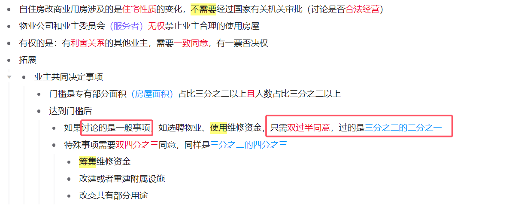
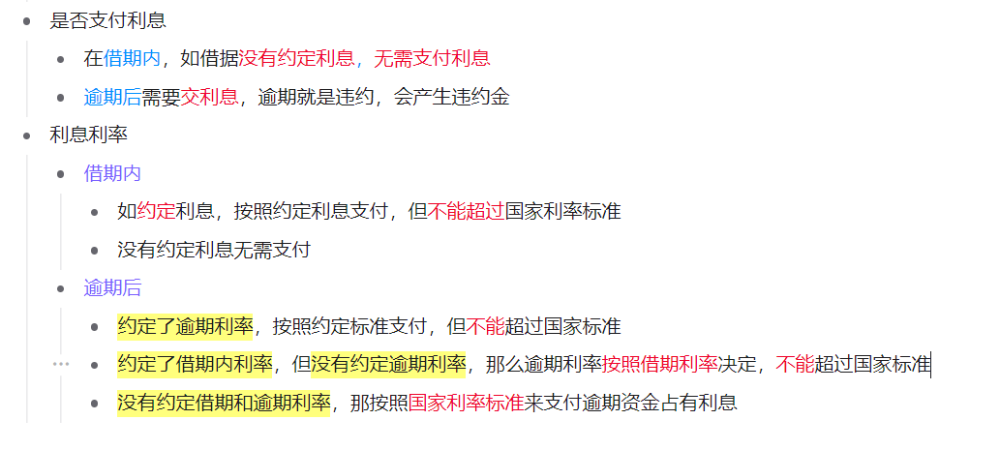

> 1.（2025）下列关于法规的表述正确的是：
>
> A.国家监察委员会根据宪法、法律和行政法规，制定监察法规
>
> B.《中华人民共和国军事设施保护法》和《国际军事合作工作条例》都属于军事法规
>
> C.地方性法规是指各地方政府按照宪法、法律、行政法规的规定制定的规范性法律文件
>
> D.党内法规是体现党的统一意志，规范党的领导和党的建设活动、依靠党的纪律保证实施的专门规章制度

 ==宪法、法律和行政法规==（法律效力等级依次递减）

| 特征维度           | **宪法**               | **法律**                   | **行政法规**                                                 |
| :----------------- | :--------------------- | :------------------------- | :----------------------------------------------------------- |
| **制定与修改机关** | **全国人民代表大会**   | **全国人大**及其**常委会** | **国务院、国家监察委、中央军委、地方人大**等                 |
| **典型名称**       | 《中华人民共和国宪法》 | 《……**法**》               | 《……**条例**》、《……**规定**》、《……**办法**》、《……**实施细则**》 |

A 选项中【国家监察委】属于行政法规制定主体，当然要根据【宪法】【法律】来指定法规，但是不必根据【行政法规】来指定法规，因为它们是平级关系。法律效力等级低者要必须服从法律效力等级高者，即制定的法律法规不能与之相抵触。

B 选项中《…法》为法律，《…条例》为法规，故前者不属于军事法规，后者属于军事法规。

==地方性法规和地方政府规章==

- **地方性法规**的制定主体是**地方国家权力机关**，即**地方人大及其常委会**。这体现了“人民代表大会”作为权力机关的地位。 常见为《XX省/市……**条例**》。
- **地方政府规章**的制定主体是**地方国家行政机关**，即**地方人民政府**。这是政府履行行政管理职能的方式。常见为《XX省/市……**规定**》、《XX省/市……**办法**》。

**简单记：法规人大定，规章政府出。**

C 既然说【地方性法规】，那主体怎么可能是【地方政府】，应该是【地方人大及其委员会】。

&nbsp;

> 2.（2025）个人信息应受法律保护，下列做法**符合个人信息保护法律规定**的是：
>
> A.某县政府网站“信息公开”栏目公布农机购置补贴发放情况，内容包括购机农户姓名、身份证号、购机型号、银行账号等基本情况
>
> B.某音乐视频教学类APP要求使用者授权其照片、文件、手机设备号、人脸等信息才提供其产品和服务，使用者同意该授权
>
> C.某住户与同层邻居一起团购可视门铃，分别安装在自己家门口，不仅能看到自家门前情况，也能看到邻居家门前情况
>
> D.某小区以刷脸作为业主出入小区的唯一验证方式，不同意某业主提出的使用密码、门禁卡等其他验证方式的要求

 **合法是前提，告知同意是关键，最小必要是底线，自愿选择是保障。**

这道题都不符合，非要选择就 C 程度相较于其它轻些。

| 法律原则             | 关键要求                                                   | 本题对应的典型违规情形                                       |
| :------------------- | :--------------------------------------------------------- | :----------------------------------------------------------- |
| **合法、正当、必要** | 处理目的、方式正当，收集信息限于**最小范围**。             | 选项B收集与功能无关的人脸信息；选项A公开非必要的银行账号。   |
| **告知同意**         | 取得个人**自愿、明确**的同意，处理敏感信息需**单独同意**。 | 选项B的强制授权；选项C未征得邻居同意。                       |
| **最小影响**         | 采取对个人权益**影响最小**的方式。                         | 选项D将影响较大的人脸识别作为唯一方式，而非提供门禁卡等影响更小的选择。 |
| **特定目的限制**     | 信息收集后**不得用于其他目的**。                           | 选项C的监控目的从自我保护扩大至窥视他人。                    |

&nbsp;

> 3.（2025）下列案例中，当事人的主张能够获得法院支持的是：
>
> A.王某以妻子未经自己同意擅自流产为由，主张妻子侵犯自己的生育权，要求进行损害赔偿
>
> B.张某与妻子离婚时，以女方一天也没有回家住过为由，主张返还按照习俗给付的18万元彩礼
>
> C.李某认为自己在婚后通过转让发明专利获得的收入为个人财产，主张不能用于偿还夫妻共同债务
>
> D.某父母为已婚女儿出资购房，并约定房屋为女儿所有，其女婿孙某离婚时主张该房屋属于家庭共同财产

==生育权男性有没有==

法律明确，女性享有独立的生育决定权。

==什么条件下允许返回彩礼==

1. 没登记结婚
2. 登记结婚但是**没有在一起生活过**【B 选项就是结婚但是从来没有生活过，故要求返回彩礼，可以得到法院支持】
3. 给彩礼导致自己生活困难

==什么不属于共同财产==

1. 婚前财产
2. 因受到人身损害获得的赔偿或补偿
3. 遗嘱或赠与合同中确定只归一方的财产
4. 专用的生活用品【具有严格人身专属性、长期归个人使用的物品。但**贵重饰品/奢侈品**可能因价值巨大被争议。】
5. 其他应当归一方的财产

C 【知识产权收益】属于共同财产，D 【约定并赠予女儿】不属于夫妻共同财产，而是属于女儿单反财产。

&nbsp;

> 4.（2025）根据《中华人民共和国民事诉讼法》，下列说法**错误**的是：
>
> A.调解维持收养关系的案件可以不制作调解书
>
> B.陪审员在执行陪审职务时，与审判员有同等的权利义务
>
> C.当事人王某对先予执行的裁定不服，可以申请复议一次
>
> D.采取对妨害民事诉讼的强制措施可以由司法行政部门决定

 ==什么情况可以不制作条件书==

| 法定情形                          | 简要说明                                                     |
| :-------------------------------- | :----------------------------------------------------------- |
| 1. **调解和好的离婚案件**         | 双方感情尚未破裂，同意继续共同生活，权利义务关系未变。       |
| 2. **调解维持收养关系的案件**     | 收养关系继续存续，权利义务内容未发生变化。                   |
| 3. **能够即时履行的案件**         | 债务等纠纷达成协议后，义务人**当庭**立即履行完毕，无后续执行问题。 |
| 4. **其他不需要制作调解书的案件** | 一般指没有后续执行内容的协议。                               |

==陪审员和审判员==

| 对比维度     | **人民陪审员 （陪审员）**(群众的司法参与者)                  | **审判员 （法官）**                                          |
| :----------- | :----------------------------------------------------------- | :----------------------------------------------------------- |
| **主要职责** | 参与**一审普通程序**的审判                                   | 负责案件审理的全过程，主持庭审，负责法律适用，并承担审判相关的所有专业工作。 |
| **权限区别** | **1. 同等权利**：在参与的案件中，**除法律另有规定外**，与审判员有同等权利（如评议时发表意见、表决）。 **2. 关键限制**：**不能担任审判长**；**不能独任审理**或主持调解；不负责撰写裁判文书等专业性极强的审判事务。 | 拥有完整的审判权，可担任审判长、独任审理、主持调解、撰写裁判文书等。 |

规定：

- 陪审员不得担任审判长和不得独任审理案件
- **审判员至少有一个**，陪审员可以没有
- 合议庭中，**陪审员的人数不能超过审判员的人数**。且人数为奇数个，否则投票会出现平局

&nbsp;

> 5.（2025）证据是引导诉讼走向的决定性因素，人民法院根据证据认定案件事实，依法作出裁判。关于证据，下列说法不正确的是：
>
> A.证据必须经过查证属实，才能作为定案的根据
>
> B.案件当事人以视听资料作为证据的，应当提供存储该视听资料的原始载体
>
> C.电子数据的制作者制作的与原件一致的副本可以视为电子数据的原件并作为证据
>
> D.证人所作的陈述必须是亲身经历的，从其他人、其他地方间接得知的不能作为证据

 ==证据==

| 证据类型            | 核心含义与常见形式                                           | 关键法律要点提示                                             |
| :------------------ | :----------------------------------------------------------- | :----------------------------------------------------------- |
| **1. 当事人的陈述** | 原告、被告等案件当事人就案件事实向法庭所作的叙述。           | 不能单独作为定案依据，需与其他证据相互印证。法院可要求当事人签署保证书，作虚假陈述需负法律责任。 |
| **2. 书证**         | 以文字、符号、图形等所记载的内容证明案件事实的材料。         | **原件优先**。提交副本/复印件需说明来源。如合同、遗嘱、书信、图纸等。 |
| **3. 物证**         | 以物品本身的外形、特征、质量、痕迹等证明案件事实的物品。     | **原物优先**。提交复制品需说明与原物核对无误。如凶器、瑕疵商品、痕迹等。 |
| **4. 视听资料**     | 以录音、录像等技术手段反映的声音、图像证明案件事实的材料。   | **应提供原始载体**（如原始录音笔）。疑有伪造、剪辑可能，需进行鉴定。 |
| **5. 电子数据**     | 通过电子邮件、即时通讯记录、网页、服务器日志等电子化形式存储的信息。 | 范围很广，包括**网络聊天记录、博客、手机短信、电子交易记录、元数据**等。**与原件一致的副本可视为原件**（你之前题目中C选项的法律依据）。 |
| **6. 证人证言**     | 了解案件情况的人（证人）向法庭所作的陈述。                   | **原则上有出庭作证的义务**。**可以陈述亲身感知，也可转述间接得知**，但后者证明力较弱（这正说明你之前题目中D选项是错误的）。 |
| **7. 鉴定意见**     | 鉴定人运用专业知识对案件专门性问题进行分析后提出的书面意见。 | 由法院委托或双方协商选定鉴定机构。当事人可申请鉴定人出庭接受质询。 |
| **8. 勘验笔录**     | 审判人员对与案件有关的现场、物品进行勘查、检验后所作的记录。 | 属于法院依职权调查收集的证据，需由勘验人、当事人和被邀参加人签名盖章。 |

&nbsp;

> 6.老张和老伴李某育有两儿一女，小儿子早逝。老张不幸去世后，没有留下遗嘱，下列关于遗产继承的说法错误的是：
>
> A.遗产分割时，应当先将老张和李某共有的财产分出一半，归李某所有，其余的属于老张的遗产 
>
> B.大儿子在外地工作，长期对老张不闻不问，应当不分或少分遗产 
>
> C.女儿因工伤丧失了劳动能力，她的配偶患病长期服药，两个孩子都还在读中学，女儿与其他继承人均等继承遗产份额 
>
> D.小儿子的妻子陈某念及公婆二人无人照顾、行动不便，平日里悉心照料二老的生活，陈某作为第一顺序继承人 

==针对这道题==

| 判断维度              | 关键规则                                                     | 错误表述常见陷阱                                       |
| :-------------------- | :----------------------------------------------------------- | :----------------------------------------------------- |
| **1. 遗产范围**       | 继承开始前，**必须先将夫妻共同财产中属于配偶的一半分出**，剩余部分才是被继承人的遗产。 | 错误说法常忽略此步骤，或将全部共同财产直接作为遗产。   |
| **2. 份额分配**       | 法定继承份额**并非绝对均等**，需根据法律规定调整： • **应当多分/照顾**：对生活有特殊困难、**缺乏劳动能力**的继承人。 • **可以多分**：尽了主要扶养义务或共同生活的继承人。 • **应当不分或少分**：有扶养能力、条件但**不尽义务**的继承人。 | 错误说法常主张“一律平均分配”，或无视上述法定调整情形。 |
| **3. 特殊继承人资格** | **丧偶儿媳/女婿**对公婆/岳父母**尽了主要赡养义务**的，作为**第一顺序继承人**，与其他子女权利同等。 | 错误说法常否定其继承资格，或将其列为第二顺序。         |

 &nbsp;

> 7.甲的牛不慎走失，乙在路边发现，遂牵回家去饲养，并请邻居帮忙寻找失主，一周后，甲听说乙曾捡到一头牛，登门辨认后，确认是自家走失的牛并要求其归还，乙同意返还，但是要求甲支付报酬2000元和饲养牛所用的青草、杂粮等费用200元，共计2200元。甲拒绝支付，两人发生争议。下列说法正确的是： 
>
> A.甲无需支付任何费用    B.甲应当支付2200元 
>
> C.甲应当支付2000元     **D.甲应当支付200元**

 ==无因管理产生的费用==

权利人领取遗失物时，应当向拾得人或者有关部门支付保管遗失物等支出的**必要费用**。权利人悬赏寻找遗失物的，领取遗失物时应当按照承诺履行义务。

- **乙要求支付的200元饲养费（青草、杂粮等）** 属于为保管遗失物而支出的**必要费用**，甲应当支付。
- **乙要求支付的2000元报酬** 没有法律依据，因为甲未悬赏寻找遗失物，拾得人无权主张报酬。

&nbsp;

> 8.某市为保护当地的湿地自然景观，制定颁布了《X市湿地保护办法》，禁止私自采掘、捕捞、打猎等行为。张某闲来无事，前往湿地景区游玩，看到两只受伤野鸭便顺手捡起，准备带回家去。在回家路上，张某携带的野鸭被正在巡逻的警察发现，警察依据《X市湿地保护办法》对其处以1000元罚款。张某不服，欲提起行政诉讼，下列说法错误的是：
>
> A.张某可以就罚款决定提起诉讼
>
> B.张某认为《X市湿地保护办法》违背上位法规定，可以只就其合法性提起诉讼
>
> C.张某可以提供行政行为违法的证据，提供的证据不成立的，不免除公安机关的举证责任
>
> D.公安机关对作出的行政行为负有举证责任，应当提供作出该行政行为的证据和所依据的规范性文件

> 9.下列有关《中华人民共和国民法典》的说法不正确的是：
>
> A.民法典将人格权独立成编，调整的是因人格权的享有和保护产生的民事关系
>
> **B.八周岁以上的未成年人为限制民事行为能力人，不可独立实施纯获利益的民事法律行为**
>
> C.民法典实施后，婚姻法、继承法、民法通则、收养法、担保法、合同法、物权法、侵权责任法、民法总则同时废止
>
> D.民法典规定，自然人享有隐私权，隐私是自然人的私人生活安宁和不愿为他人知晓的私密空间、私密活动、私密信息

 八周岁以上的未成年人==可以==独立实施纯获利益的民事法律行为。这是其法定例外权利。

| 类别                   | 法定情形                                                     | 可以独立实施的行为（有效）                                   | 不能独立实施的行为及后果                                     |
| :--------------------- | :----------------------------------------------------------- | :----------------------------------------------------------- | :----------------------------------------------------------- |
| **无民事行为能力人**   | 1. **不满8周岁**的未成年人。 2. **不能辨认**自己行为的成年人（及8周岁以上的未成年人）。 | **理论上无**。所有民事法律行为均应由其**法定代理人（监护人）代理**。 | 其独立实施的任何民事法律行为（包括接受赠与等纯获利益行为）**原则上无效**。 |
| **限制民事行为能力人** | 1. **8周岁以上**的未成年人。 2. **不能完全辨认**自己行为的成年人。 | 1. **纯获利益**的法律行为（如接受赠与、奖励）。 2. 与其**年龄、智力、精神健康状况相适应**的行为（如购买日常文具、零食，乘坐公交）。 | 实施其他法律行为（如大额消费、签订合同）需**法定代理人同意或追认**，否则行为**效力待定**，代理人拒绝追认则无效。 |
| **完全民事行为能力人** | 1. **年满18周岁**的成年人。 2. **16周岁以上**，**以自己的劳动收入为主要生活来源**的未成年人。 | 可以独立实施**一切**民事法律行为，并独立承担法律责任。       | 不适用。                                                     |

要也别注意【限制民事行为能力人】和【完全民事行为能力人】的年龄判断上的特例。

&nbsp;

> 10.根据我国法律规定，下列表述正确的是：
>
> A.甲应聘某基层人民法院陪审员，其就职时可以依照法律规定公开进行宪法宣誓
>
> B.乙是某大型超市收银员，利用工作便利私自窃取货款5万元，其行为构成贪污罪
>
> **C.丙是某县负责抗洪指挥工作的领导，在救灾过程中带人打麻将，未及时检查造成垮堤，其行为构成玩忽职守罪**
>
> D.丁是某市电视台总导演，利用职务便利收受他人财物数额巨大，但因其不属于国家工作人员，因此不构成贪污罪

某市电视台总导演 属于  国家工作人员。

==贪污罪==

- **身份**：必须具有“国家工作人员”身份（依法从事公务的人员）。
- **行为**：利用主管、管理、经手公共财物的职务便利，将其非法占有。

==受贿罪==

- **身份**：同样要求是国家工作人员。
- **行为**：利用职权或地位形成的便利条件，为他人谋利并收受财物。==“为他人谋取利益”是核心要件==，无论利益是否正当、是否实现。
- **与贪污罪区别**：贪污是拿“公家”的钱，受贿是拿“别人（请托人）”的钱。

==职务侵占罪==

- **身份**：非国有单位的工作人员。
- **行为**：利用在单位担任的职务所形成的便利，非法占有本单位财物。

&nbsp;

> 11.下列关于法律基础知识的表述正确的是：
>
> A.司法机关在适用法律审理案件时，优先适用法律原则，再适用法律规则
>
> **B.法的渊源通常指法的形式意义上的渊源，即法律规范的创制方式和外部表现形式**
>
> C.法的公布与法的实施是两个不同的概念，但实践中法的公布日期即法的实施日期
>
> D.当同一机关制定的法律出现效力冲突时，一般解决原则是新法优于旧法，一般法优于特别法
>

 司法机关在适用法律审理案件时，通常优先适用具体的法律规则，只有在缺乏规则或规则可能导致严重不公时，才考虑适用法律原则。法律原则的适用具有补充性和限制性。

实践中，法律可能规定自公布之日起施行，也可能规定在未来某个特定日期生效。

同一机关制定的法律出现效力冲突时，一般适用==新法优于旧法==、==根本法优于普通法==、==上位法优于下位法==、==特别法优于一般法==的原则。

&nbsp;

> 12.胡女士在甲公司APP上看到乙酒店某型客房贵宾优惠价为2889元后付款，次日却发现该房型当晚的实际挂牌价仅1377元。胡女士认为其作为贵宾客户却支付了高于实际价格的费用，遂将甲公司起诉至法院。关于此案，下列说法**错误**的是：
>
> A.甲公司存在价格欺诈行为，胡女士有权退一赔三
>
> B.甲公司向胡女士承诺贵宾优惠价，但未践行承诺，侵害了胡女士的公平交易权
>
> **C.甲公司的行为导致胡女士遭受了不必要的经济损失，侵害了胡女士的财产安全权**
>
> D.甲公司APP作为中介平台，其未如实标注该房型的真实价格，侵害了胡女士的知情权
>

- **知情权**是关于 **“知不知道”**——信息是否真实透明。
- **公平交易权**是关于 **“公不公平”**——交易条件是否合理。
- **财产安全权**是关于 **“安不安全”**——消费过程是否会对人身或现有财产造成物理损害。

| 对比维度     | **“退一赔三”（一罚三）**【最低赔付500元】                    | **“退一赔十”（一罚十）**【最低赔付1000元】                   |
| :----------- | :----------------------------------------------------------- | :----------------------------------------------------------- |
| **适用领域** | **所有商品或服务**的消费（如家电、服装、旅游、培训等）       | **仅限食品**（包括预包装食品、餐饮等）                       |
| **核心条件** | 经营者提供商品或服务有**欺诈行为**（如虚假宣传、以假充真、隐瞒真相等） | 生产不符合食品安全标准的食品，或经营**明知**是不符合食品安全标准的食品 |
| **赔偿计算** | **退货款 + 货款/服务费的3倍赔偿**（总金额为“退一赔三”，即支付4倍） | **退货款 + 支付价款的10倍赔偿** 或 **损失的三倍赔偿**        |

**常见的无效“罚款”**：

- **“偷一罚十”无效**：商场等经营者没有行政处罚权，自行规定的“偷一罚十”属于**无效的私力处罚**。对盗窃行为，商家应报警处理，无权自行罚款。
- **“以一罚十”的约定可能有效**：如果这是商家在合同或承诺书中自愿作出的**惩罚性违约金**条款，且内容不违法，则可能被认定为有效。

&nbsp;

> 13.下列精神损害赔偿不予支持的是：
>
> **A.甲被人殴打致重伤二级，其提出刑事附带民事诉讼要求精神损害赔偿**
>
> B.乙被错误逮捕，后案件被撤销，乙在申请国家赔偿的同时要求精神损害赔偿
>
> C.丙父去世后，其仇人散布谣言侮辱其父名誉，丙诉至法院要求精神损害赔偿
>
> D.丁保留的与其生母唯一一张合影被人恶意损毁，丁诉至法院要求精神损害赔偿
>

 刑事附带民事诉讼程序==明确排除精神损害赔偿==（所以 A 错误），而国家赔偿、普通民事诉讼则在符合法定条件时予以支持。

财产损失一般不会就剩损害赔偿，但是 D 这种特殊情况可以。

&nbsp;

> 14.2023年9月1日，江某在广东某酒店购买高档月饼1盒，付款3000元。江某食用后出现严重腹泻，花费2000元治
>
> 疗，后查明，该月饼外包装标识均为繁体字，保质期限截止到2023年8月30日。对此，下列说法错误的是：
>
> A.该月饼外包装必须依法标注简体中文
>
> B.该酒店出售明知不符合食品安全标准的食品，应当对其予以行政处罚
>
> C.江某有权要求某酒店赔偿2000元损失，并要求支付30000元的赔偿金
>
> **D.江某已知该月饼已经超过保质期仍然购买，其自身也有问题，只能要求某酒店退还购买月饼的3000元**

&nbsp;

> 15.下列属于《中华人民共和国劳动法》所调整的劳动关系的是：
>
> A.大学生小张利用假期到餐馆打工 
>
> B.王某雇请保姆为其提供家务劳动
>
> C.村民老马在农忙时雇请他人为其收割庄稼 
>
> D.大学英语教师小李在某国领事馆兼职从事翻译工作

满足下面三个条件：

1.  境内（中国以内）
2. 企业（盈利企业）和个体经营组织（雇佣人数必须小于等于 7 个人）
3. 劳动者（法定年龄大于等于 16 岁）

B 企业或个体经营组织；C 同上；D 不在境内。

A 虽然不严谨，但比另外三个好些。

&nbsp;

> 16.某小区业主王某拟将其自住用房改为民宿用房，物业公司和业主委员会不同意，为此发生争执。下列与之相关的说法正确的是：
>
> A.小区业主未经国家有关机关审批，不得将自住用房改为民宿用房
>
> B.小区业主未经小区物业公司和业主委员会同意，不得将自住用房改为民宿用房
>
> **C.小区业主未经有利害关系的其他业主一致同意，不得将自住用房改为民宿用房**
>
> D.小区业主未经三分之二以上有利害关系的其他业主同意，不得将自住用房改为民宿用房
>

 “住改房”**必须**经有利害关系的业主**一致同意**，C 正确。

&nbsp;

> 17.关于《中华人民共和国民法典》，下列说法错误的是：
>
> A.允许抵押耕地使用权 
>
> B.将绿色原则作为民法的基本原则
>
> C.明确了生态环境损害的修复和赔偿规则 
>
> **D.将无民事行为能力人最高年龄标准调整为10周岁**

 前面就讲过，是 8 岁以下为无民事行为能力的年龄。

&nbsp;

> 18.某小区业主拟将其住宅改变为经营性民宿，下列选项中**不属于**其应当具备的前提条件是：
>
> A.应当遵守国家有关公共防疫的规定 
>
> B.应当遵守由业主共同制定的管理规约
>
> C.应当获得该业主所在楼栋的其他全体业主同意 
>
> **D.应当获得小区全体业主三分之二以上多数同意**

 住改房，所以要都同意。

&nbsp;

> 19.王某向李某借款1万元，李某当场向王某交付现金1万元，王某向李某出具借条一份，张某在该借条上签字，后王某没有按时还钱，李某将王某和张某同时起诉至法院，要求王某还钱，并要求张某承担连带责任。关于张某的责任，下列说法正确的是:
>
> A.张某只是作为见证人签字，无须承担任何责任
>
> B.张某在别人的借条上签字，应当推定为保证人，并承担保证责任
>
> C.张某在别人的借条上签字，视同共同借款人，应当承担共同还款责任
>
> **D.只要借条上没有任何明确表述或其他事实表明张某愿意承担保证责任的，张某即无须承担任何责任**

 保证合同成立的前提是保证人作出 **“明确的意思表示”** 。一个孤立的签名，无法推断出“愿意在债务人不还钱时代为偿还”这样重大的法律意思。

&nbsp;

> 20.甲方将乙方诉至人民法院，要求乙方偿还借款期限为一年，且已到期的2万元借款以及借款利息。在诉讼中，
>
> 甲方向法庭提交了借据作为乙方借款的证据。下列与之相关的说法正确的是：
>
> A.甲方除了提交借据外，还需要提交向乙方实际付款的凭证，才能证明甲、乙双方之间的借贷关系真实发生
>
> **B.虽然借据上未约定利息，但是乙方仍应按照年利率 的标准向甲方支付借期内和逾期后的资金占用利息**
>
> C.甲方提交借据足以证明甲、乙双方之间的借贷关系合法成立，乙方抗辩无效
>
> D.借据上没有约定利息，故乙方无须向甲方支付借期内利息
>

 只要有借据存在，就能证明双方的借贷关系成立，无需实际付款凭证【但并非绝对证明，只是说借据是优势证据，但非“一票定案”】。

借期内没有规定利息可以不付，逾期后就不可以：

&nbsp;

> 21.李某认为某电商平台上的商户所销售服装的外观侵害了其设计著作权，于是通知电商平台对该商户采取删除、
>
> 屏蔽、断开链接、终止交易和服务等措施。关于李某的上述通知，下列说法正确的是：
>
> A.李某只需要提出主张，无须举证，举证商户是否侵权的责任由电商平台和商户承担
>
> B.李某通知错误，造成商户损失的，李某应当加倍赔偿商户损失
>
> C.李某必须提供商户侵权的确切证据
>
> **D.李某必须提供商户侵权的初步证据**

**有效的初步证据**通常应包括：**权利证明**（如著作权登记证书、设计手稿等）、**侵权链接**、以及能初步说明**侵权事实**的对比材料或说明。这足以让电商平台进行初步判断。它并非要求权利人提供像在法院诉讼中那样确凿无疑的“铁证”，但也不能是毫无根据的指责。

等到真正打官司的时候，再提供确切的证据。如果一开始就给商户提供确切证据，就暴露自己的知识产权的机密了。

&nbsp;

> 22.下列关于自首的判断说法正确的是：
>
> A.甲和乙共同实施盗窃犯罪，后甲因为内心害怕，主动到公安机关交代，并独自承担了全部罪行，甲构成自首
>
> B.甲和乙共同实施诈骗犯罪，后甲因酒驾被公安机关讯问时，主动交代乙曾经实施的故意杀人行为，甲构成自首
>
> **C.王某交通肇事逃逸，其父知道后将其扭送至公安机关，王某主动交代了其肇事逃逸行为，王某构成自首**
>
> D.甲公司非法集资且规模很大，该公司总经理李某因为害怕，瞒着其他高管偷偷到公安机关交代了相关情况，李某作为单位犯罪的直接责任人不能单独成立自首

 ==自首==

1. 主动投案

- 明知他人报案而在现场**等待**，抓捕时无拒捕行为。
- 在**未被讯问、未被采取强制措施**时，因形迹可疑被盘问后主动交代。
- **经亲友规劝、陪同投案**，或==亲友主动报案后送其归案==（例如你之前题目中“父亲扭送”的情形，只要其到案后自愿交代，就视为自动投案）。

2. 如实交代==自己的==**主要犯罪事实**，不得有半点隐瞒

- **“主要犯罪事实”**：即足以影响定罪量刑的核心事实，如犯罪时间、地点、手段、结果等。对细节的推敲不影响认定。
- **共同犯罪中的特殊要求**：除供述本人罪行外，还需供述所知的**同案犯**；若为主犯，则需供述所知其他同案犯的共同犯罪事实。
- **“如实”的底线**：不能隐瞒主要事实或冒名顶替。如果只交代部分轻罪而隐瞒重罪，则对重罪部分不构成自首。

==特殊自首==

| 形式                   | 名称                               | 适用条件                                                     | 法律后果                                                     |
| :--------------------- | :--------------------------------- | :----------------------------------------------------------- | :----------------------------------------------------------- |
| **特别自首（准自首）** | 犯罪嫌疑人、被告人和正在服刑的罪犯 | 因涉嫌**特定违法行为**（如酒驾）被公安机关讯问，或在被采取强制措施、服刑期间，**主动交代**司法机关尚未掌握的**其他不同种罪行**。 | 以自首论，可以从轻或减轻处罚。                               |
| **单位自首**           | 单位（公司、企业等）               | 由**单位集体决定**或由**负责人决定**，并派员向司法机关自动投案、如实交代单位罪行。 | 对单位及直接负责的主管人员和其他直接责任人员均可认定为自首，并依法从宽处理。 |

&nbsp;

> 23.2023年3月1日，兰某入职某公司，入职10天后兰某发现自己怀孕，于是经常迟到早退，有时还旷工，==已经达到了员工手册规定的解聘条件==。2023年5月30日公司宣布解聘兰某。对于公司的解聘行为，下列说法正确的是：
>
> **A.公司有权解聘兰某，且无需支付经济补偿金**
>
> B.公司有权解聘兰某，但必须支付经济补偿金
>
> C.兰某处于孕期，按照劳动法的规定，公司不得解聘
>
> D.公司违法解除与兰某的劳动关系，应当双倍支付经济补偿金
>

 没有达到【员工手册规定的解聘条件】，依然被解除就属于违法解除，可以申请【双倍支付经济补偿金】。

达到【员工手册规定的解聘条件】，这属于严重违反用人规定，即便你是孕妇，公司有权解聘兰某，且无需支付经济补偿金。

法律禁止的是公司因女职工怀孕本身或非自身过错原因（如结构调整、经济困难、无法胜任工作等）将其辞退。

&nbsp;

> 24.根据我国《立法法》，下列说法正确的是：
>
> A.设区的市制定的地方性法规须报省政府备案
>
> B.省人大常委会须对地方性法规的合法性进行审查
>
> C.设区的市制定的地方性法规，其立法主体为市政府
>
> D.经省人大常委会授权后，设区的市才能制定地方性法规
>

 

&nbsp;

> 25.某超市为顾客提供免费寄存服务。一日超市顶上商户水管漏水，水淹到低层寄存柜，致王某放在柜中的手机进水损坏。对此，下列说法正确的是：
>
> A.超市有过失，应当承担全部赔偿责任 
>
> B.漏水属不可抗力，超市不承担赔偿责任
>
> **C.超市系无偿保管且无重大过失，不予赔偿** 
>
> D.主要责任在漏水商户，超市承担部分赔偿责任
>

 

> 26.《中华人民共和国法律援助法》对于规范和促进法律援助工作、保障公民和有关当事人合法权益具有重大意义。下列情况属于可经指派获得法律援助的是： 
>
> ①15岁的学生小明涉嫌贩卖毒品，没有委托辩护人 
>
> ②25岁的精神病人赵某涉嫌抢劫，其患病多年经济困难，没有委托辩护人 
>
> ③35岁的村民张某因向村中水井投毒，可能被判处死刑，没有委托辩护人 
>
> ④45岁的聋哑人李某创设公司后涉嫌逃税罪，其个人资产过亿，没有委托辩护人 
>
> A. ①②③  B.②③④  C.①③④  D.①②③④
>

1. **绝对指派，无关财力**：对于法律明确列举的几类特殊人群（**未成年人、盲聋哑人、精神病人**）以及**可能判处无期、死刑**的案件，只要没有委托辩护人，办案机关**必须**通知法律援助机构指派律师。**当事人的经济状况完全不影响这一决定的作出**。
2. **与“申请指派”的区别**：除了上述“应当指派”的情形外，对于其他因**经济困难**没有委托辩护人，且案件类型符合规定的当事人，他们可以**申请**法律援助。本题所有案例均属于更优先的“应当指派”范畴。

27.2020年1月李某因意外事件下落不明，2022年3月李某的丈夫盛某向法院申请宣告李某死亡，法院于2022年4月

10日作出判决。2022年8月，李某返回家中，发现盛某已与另一名女子杜某结婚，自己的女儿已被朋友艾某收养。下列与之相关的说法错误的是：

A.艾某收养李某女儿的行为继续有效

B.李某可以向法院申请撤销死亡宣告

C.李某与盛某的婚姻关系不能自行恢复

D.李某在2020年1月至2022年8月期间实施的民事法律行为无效

 

28.下列人员有资格担任公司法定代表人的是：

A.张某，14周岁，已是3家公司的股东

B.薛某，因创业失败对外负债1000万，到期未清偿

C.周某，曾因犯贿赂罪被判处刑罚，执行期满刚过3年

D.李某，曾任投资咨询公司董事，该公司已经被责令关闭2年

 

29.下列选项中，构成法律上的不作为犯罪的是：

A.某商场工作人员下班前看到地上有别人扔的未熄灭的烟头，未进行处理，结果引起大火，整座商场被烧毁，损失严重

B.同学二人相约去海边游泳，一人游泳溺水，另一人明明有能力施救，但是因为害怕在水中被缠住遭遇危险而没有去救援，结果溺水者死亡

C.两位警察下班后相约便衣乘坐公交，公交车上遇见一群人持刀互殴致人死亡，警察因为害怕且想到自己已下班，未处于执行任务期间，故未实施制止行为

D.李某过马路时看见一位老人在他前面突然摔倒，但是周围没有其他人，李某没有扶老人，也没有报警，扬长而去，后该老人因脑溢血未得到及时救治而死亡

 

30.关于安全生产管理工作，下列说法正确的是：

A.机关、团体、企业、事业等单位应当对建筑消防设施每季度至少进行一次全面检测

B.未造成人员伤亡的一般事故，县级人民政府可以委托事故发生单位组织事故调查组进行调查

C.交通运输主管部门负责危险化学品的公共安全管理，核发剧毒化学品购买许可证、剧毒化学品道路运输通行证

D.安全生产监督管理部门和负有安全生产监督管理职责的有关部门逐级上报事故情况，每级上报的时间不得超过1小时

 

31.根据《中华人民共和国监察官法》，下列关于监察官回避制度的说法错误的是：

A.张某担任某设区的市监察委员会副主任，应当实行地域回避

B.王某和李某都是监察官，二人系夫妻关系，不能被派驻到同一高校

C.赵某一和赵某二系亲兄弟，可以同时担任某县监察委员会不同部门的监察官

D.黄某担任某设区的市监察委员会副主任，其子不得担任该市下辖的县监察委员会委员

1. **地域回避**（第23条）：仅适用于**主任**（县级、设区的市级），不适用于副主任。
2. **任职回避**（第24条）：针对有特定亲属关系的监察官，禁止他们担任四类有上下级、监督或密切关联的职务。

32.根据我国《民事诉讼法》有关规定，人民法院有关民事诉讼法的地域管辖的表述错误的是：

A.遗产继承——原告住所地   B.不动产——不动产所在地

C.合同——被告住所地、合同履行地 D.侵权——侵权行为地、被告住所地

 

33.根据2023年9月1日修正的《中华人民共和国民事诉讼法》，下列关于案件审理说法正确的是：

A.人民法院审理民事案件，合议庭组成人员必须包括人民陪审员

B.人民法院审理第一审民事案件，合议庭的成员人数必须是双数

C.适用简易程序审理的第一审民事案件，由审判员一人独任审理

D.人民陪审员在参加审判活动时不具有与审判员相同的权利义务

 

34.新时代以来，我国保护个人信息的立法进程加快。关于个人信息的法律保护，下列说法不正确的是：

A.《刑法修正案（十二）》新增“非法获取公民个人信息罪”

B.《网络安全法》规定网络运营者不得泄露、改、毁损其收集的个人信息

C.《民法典》将自然人的电子邮箱、健康信息、行踪信息等列入个人信息范围

D.《个人信息保护法》以专章规定了个人信息跨境提供的规则

 

35.根据《中华人民共和国立法法》，关于法律解释，下列说法不正确的是：

A.法律解释权属于全国人民代表大会常务委员会

B.法律解释草案表决稿由常务委员会全体组成人员的过半数通过，由常务委员会发布公告予以发布

C.省级人民代表大会常务委员会可以提出法律解释要求

D.法律解释同法律不具有同等效力

 

36.我国现行宪法公布实施40年来，全国人大先后五次对宪法内容作出必要的修正。其中，下列修正按时间先后排序正确的是：

①将“公民的合法的私有财产不受侵犯”写入宪法

②增加“国家允许私营经济在法律规定的范围内存在和发展。私营经济是社会主义公有制经济的补充”规定

③增加“中华人民共和国实行依法治国，建设社会主义法治国家”规定

④将“我国正处于社会主义初级阶段”“建设有中国特色社会主义的理论”提法写进宪法序言

⑤将国家建设目标修改为“建设成为富强民主文明和谐美丽的社会主义现代化强国，实现中华民族伟大复兴”

A. ②④③①⑤ B.①④②③⑤ C.④②①⑤③ D.③②④⑤①

 

37.根据《公务员法》规定，下列说法正确的是：

A.某副市长王某对该市一起重大矿难事故负领导责任，王某应当引咎辞去公职

B.某县交通局正科级干部刘某因渎职被给予降级处分，刘某受处分期间为12个月

C.某县水利局科员赵某因玩忽职守被给予记过处分，该处分可以口头方式通知赵某

D.某县公安局警察钱某在外兼职，该兼职必须经有关机关批准，并不得领取兼职报酬

 

38.根据《中华人民共和国反电信网络诈骗法》，下列行为没有违背法律规定的是：

A.某电信营业厅未对办理电话卡的用户进行真实身份信息登记

B.某网络公司拒绝为没有提供真实身份信息的用户安装网络

C.某市民自愿将自己的电话卡出借给朋友使用

D.某银行为存在异常开户情形的客户开立账户

 

39.司机王某骑电动自行车载其外籍女友去艺术馆参观，二人均未佩戴头盔，被交警发现。对于二人可能面临的行

政处罚，下列表述正确的是：

A.交警可以当场对王某进行罚款

B.交警可以暂扣王某的机动车驾驶证

C.王某女友适用《中华人民共和国行政处罚法》，可予以行政拘留

D.王某女友不适用《中华人民共和国行政处罚法》的规定，不予处罚

